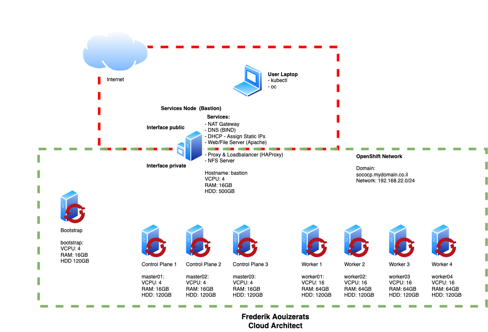
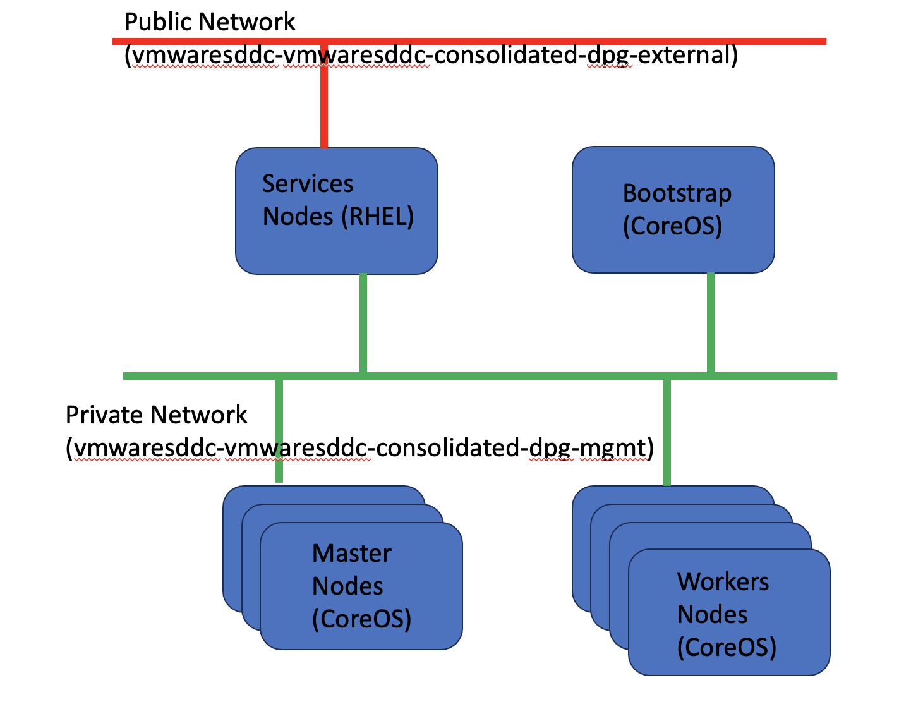
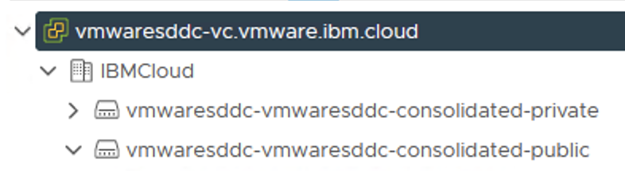
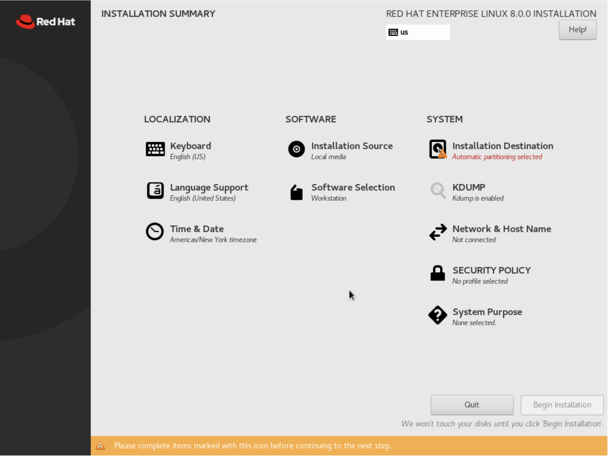
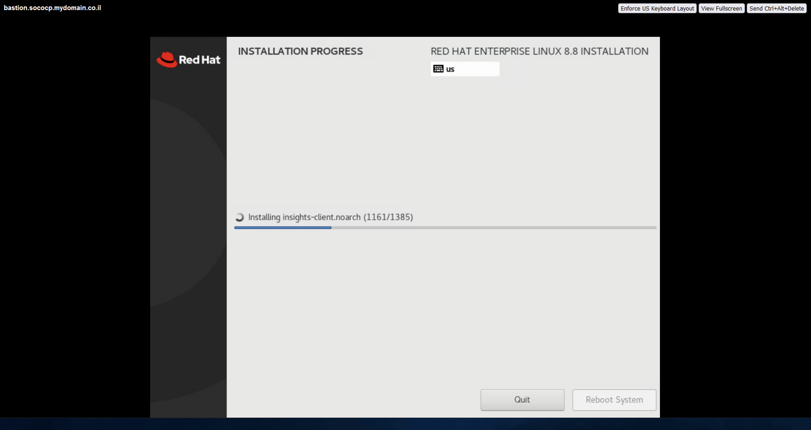
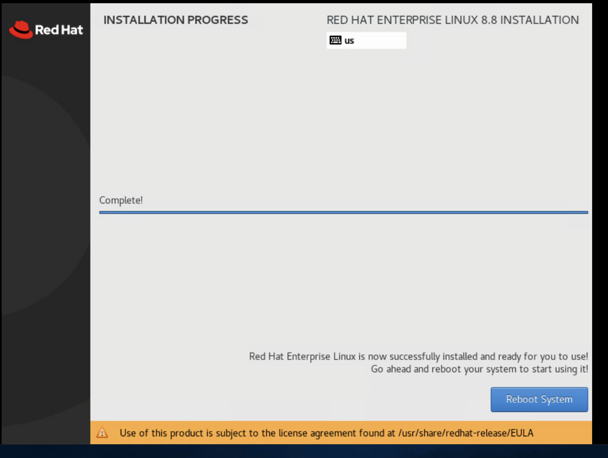
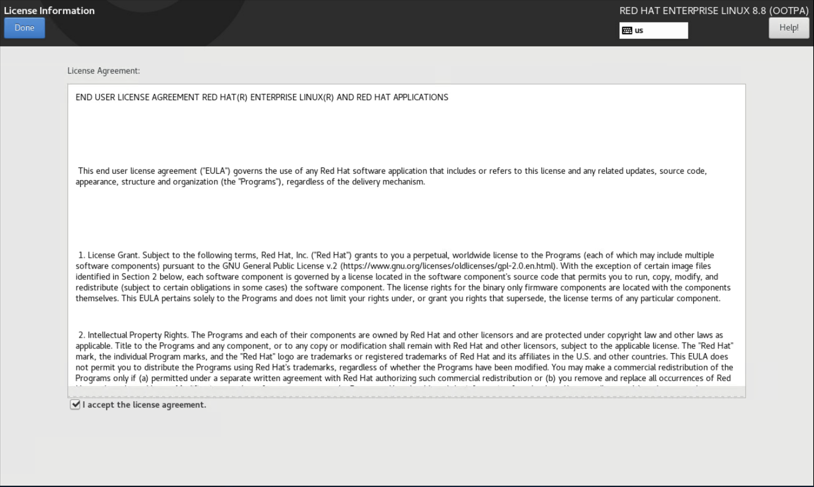
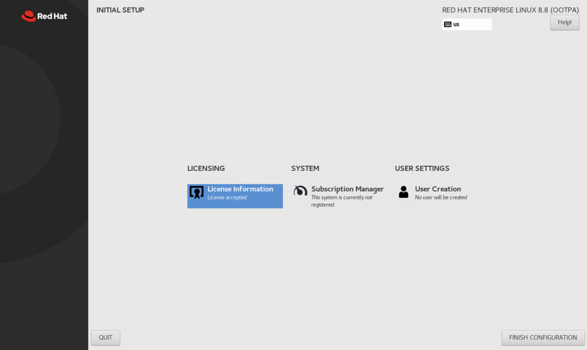
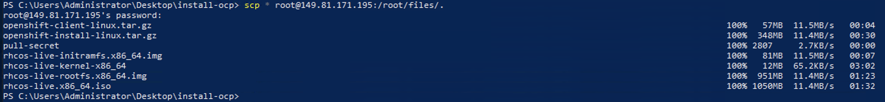
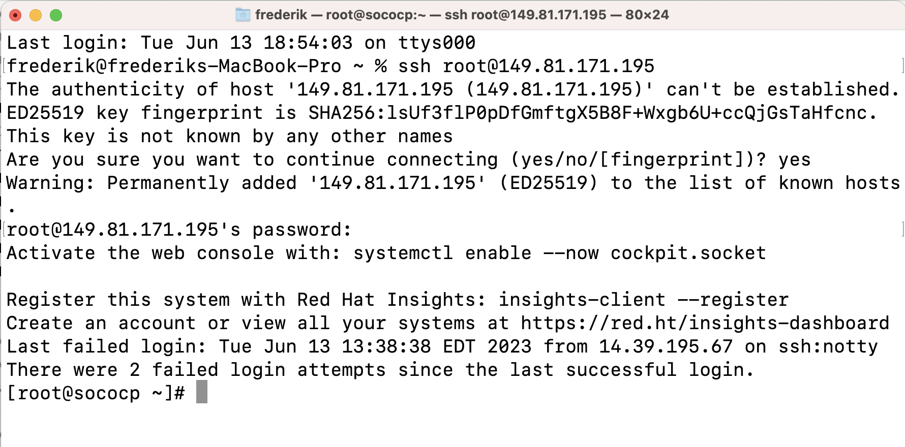

## Generic OCP topology architecture
<picture>
 
</picture>

## Prepare your topology for a deployment on a VMware vSphere Infrastructure on an IBM Cloud SDDC
<picture>
 
</picture>

## Prepare the Network
You need 2 Networks: A Private Network (green) and A Public Network (red)
    <picture>
     
    </picture>

## Prepare the Nodes
    Create Control Plane nodes: 
	    Name: master01, matser02 and master03
	    4vcpu
	    16GB RAM
	    120GB HDD
	    NIC connected to vmwaresddc-vmwaresddc-consolidated-dpg-mgmt port group
	    Load the rhcos-X.X.X-x86_64-installer.x86_64.iso image into the CD/DVD drive
    Create Worker nodes: 
        Name: worker01,worker02 and worker03
        16vcpu
        64GB RAM
        120GB HDD
        NIC connected to vmwaresddc-vmwaresddc-consolidated-dpg-mgmt port group
        Load the rhcos-X.X.X-x86_64-installer.x86_64.iso image into the CD/DVD drive
    Create a Bootstrap node (this vm will be deleted once installation completes) 
        Name: bootstrap
        4vcpu
        16GB RAM
        120GB HDD
        NIC connected to vmwaresddc-vmwaresddc-consolidated-dpg-mgmt port group
        Load the rhcos-X.X.X-x86_64-installer.x86_64.iso image into the CD/DVD drive
    Create a Services node: 
        Name: bastion
        4vcpu
        16GB RAM
        500GB HDD
        NIC1 connected to vmwaresddc-vmwaresddc-consolidated-dpg-external
        NIC2 connected to vmwaresddc-vmwaresddc-consolidated-dpg-mgmt port group
        Load the CentOS_8.iso or RHEL 8 image into the CD/DVD drive
        Boot all virtual machines so they each are assigned a MAC address (wait 5 mins)
        Shut down all virtual machines except the services node

## Download Softwares
    Download Centos 8 or RHEL 8 https://access.redhat.com/downloads
    Download Openshift software required for installation
    Login to RedHat OpenShift Cluster Manager: https://console.redhat.com/openshift/create
    Select “Create Cluster' from the” Clusters' navigation menu
    Select “Datacenter”
    Select “Bare Metal (x86_64)”
    Select “Full control”
    Download the following files:
        OpenShift Installer for your OS
        pull secret
        command-line tools for your OS
        Red Hat Enterprise Linux CoreOS (RHCOS) files:
        rhcos-X.X.X-x86_64-metal.x86_64.raw.gz
        rhcos-X.X.X-x86_64-installer.x86_64.iso (or rhcos-X.X.X-x86_64-live.x86_64.iso for newer versions)

## Get the nodes Mac Address list
    Get the Mac adress list using Power Shell CLI for VMware
    https://developer.vmware.com/powercli/installation-guide
    Install-Module -Name VMware.PowerCLI
    Import-Module VMware.VimAutomation.Core
    Connect-VIServer -Server <IP/FQDN> -Protocol https -User <username> -Password <password>
    Get-VM | Get-NetworkAdapter | Select-Object Parent,Name,MacAddress | select-string "ocp"
        @{Parent=bastion.sococp.mydomain.co.il; Name=Network adapter 1; MacAddress=00:50:56:a5:5d:3e}
        @{Parent=bastion.sococp.mydomain.co.il; Name=Network adapter 2; MacAddress=00:50:56:a5:a0:9a}
        @{Parent=bootstrap.sococp.mydomain.co.il; Name=Network adapter 1; MacAddress=00:50:56:a5:d2:93}
        @{Parent=master03.sococp.mydomain.co.il; Name=Network adapter 1; MacAddress=00:50:56:a5:ec:51}
        @{Parent=master0`1.sococp.mydomain.co.il; Name=Network adapter 1; MacAddress=00:50:56:a5:3e:7e}
        @{Parent=worker02.sococp.mydomain.co.il; Name=Network adapter 1; MacAddress=00:50:56:a5:e9:73}
        @{Parent=master02.sococp.mydomain.co.il; Name=Network adapter 1; MacAddress=00:50:56:a5:02:2b}
        @{Parent=worker03.sococp.mydomain.co.il; Name=Network adapter 1; MacAddress=00:50:56:a5:38:e0}
        @{Parent=worker04.sococp.mydomain.co.il; Name=Network adapter 1; MacAddress=00:50:56:a5:46:b2}
        @{Parent=worker01.sococp.mydomain.co.il; Name=Network adapter 1; MacAddress=00:50:56:a5:18:c8}

## Install Service node (called also bastion but this name is confusing)
    Choose English key boad and keep defaults value till the main install conf screen
    Remove the home dir partition and assign all free storage to '/'
    Assign a private IP@ to private interface
    Assign a public IP@ to public interface
    Add default route on the public IP@

<picture>
    
</picture>
    wait the installation completed

<picture>
    
</picture>

<picture>
    
</picture>

<picture>
    
</picture>

<picture>
    
</picture>

## Move the files downloaded to the services node
<picture>
    
</picture>

## Configure Service node 
    ssh root@publicIP / password
<picture>
    
</picture>
    
## Extract Client tools and copy them to /usr/local/bin
    tar xvf openshift-client-linux.tar.gz
    mv oc kubectl /usr/local/bin

## Confirm Client Tools are working
    kubectl version
    oc version

## Generate SSH key pair on your service node for authentication onto your cluster nodes
    ssh-keygen -t ed25519 -N '' -f <path>/<file_name> 

## Check ssh-agent process status
    eval "$(ssh-agent -s)"

## Extract the OpenShift Installer
    tar xvf openshift-install-linux.tar.gz

## Register for a Redhat account
    https://sso.redhat.com/auth/realms/redhat-external/login-actions/registration?client_id=rh_product_trials&tab_id=7EqFfXvrcz4

## Request a trial 60 days subscription for rhel
    https://www.redhat.com/en/technologies/linux-platforms/enterprise-linux/server/trial

## Use this account to register your service node for update repositories
    [root@sococp files]# subscription-manager register
    Registering to: subscription.rhsm.redhat.com:443/subscription
    Username: frederik.aouizerats@laposte.net
    Password: 
    The system has been registered with ID: 4bd0207a-edf1-47c3-9d8e-ee58d753a85b
    The registered system name is: sococp.mydomain.co.il
    [root@sococp files]# 

## Update RHEL so we get the latest packages for each of the services we are about to install
    Add a Public DNS 8.8.8.8
    vi /etc/resolv.conf

## Update RHEL so we get the latest packages for each of the services we are about to install
    dnf update

## Install Git
    dnf install git -y

## Download the configuration files for each of the services (DNS. DHCP, HA Proxy and install-config.yaml)
    git clone https://github.com/FrederikAouizerats/ocp-vSphere.git

## Check the adapter with the private IP@
    [root@svcnode ocp-vSphere]# ip -br a
    lo        UNKNOWN    127.0.0.1/8 ::1/128
    ens192      UP       10.126.8.130/26 fe80::20c:29ff:feb9:1d12/64
    ens224      UP       159.8.81.98/28 fe80::83b:10e6:5ff2:35ee/64
    baremetal   DOWN
    virbr0      DOWN     192.168.122.1/24

## Check the Static private IP@ for OCP network interface nmtui-edit ens224 or ens224 OR edit /etc/sysconfig/network-scripts/ifcfg-ens192 or ifcfg-ens224
    Address: 192.168.22.1
    DNS Server: 127.0.0.1
    Search domain: sococp.mydomain.co.il
    Never use this network for default route
    Automatically connect

## If you need to modify the private adapter configuration to configure the domain
    nmtui ens224 or ens192

## Setup firewalld
    nmcli connection modify ens192 connection.zone internal
    nmcli connection modify ens224 connection.zone external

## Check zones creation
    firewall-cmd --get-active-zones

## Set masquerading (source-nat) on the both zones.
    firewall-cmd --zone=external --add-masquerade --permanent
    firewall-cmd --zone=internal --add-masquerade --permanent

## Reload firewall config
    firewall-cmd --reload

## Check the current settings of each zone
    firewall-cmd --list-all --zone=internal
    firewall-cmd --list-all --zone=external

## Enable IP Forwarding Linux's kernel feature (result should be "1")
    cat /proc/sys/net/ipv4/ip_forward

## Install and configure BIND DNS
    dnf install bind bind-utils -y
    mv /etc/named.conf /etc/named.conf.ori
    cp ~/"dir where you cloned the git"/dns/named.conf /etc/named.conf
    cp -R ~/"dir where you cloned the git"/dns/zones /etc/named/

## Configure the firewall for DNS
    firewall-cmd --add-port=53/udp --zone=internal --permanent

## for OCP 4.9 and later 53/tcp is required
    firewall-cmd --add-port=53/tcp --zone=internal --permanent
    firewall-cmd --reload

## Adapt Bind configuration files
    You need to adapt the files named.conf, zones/"your domain-name", zones/"your reverse resolution file"

## Enable and start the service
    systemctl enable named
    systemctl start named
    systemctl status named

## Change the LAN nic (ens192) to use 127.0.0.1 for DNS AND ensure Ignore automatically Obtained DNS parameters is ticked
    nmtui-edit ens192   

## Restart Network Manager
    systemctl restart NetworkManager

## Confirm dig now sees the correct DNS results by using the DNS Server running locally
    dig lab.ocp.lan

# The following should return the answer ocp-bootstrap.lab.ocp.lan from the local server
    dig -x "private IP@ assigned to the bootstrap"

## Install the DHCP Server
    dnf install dhcp-server -y

## Copy the conf file to the correct location for the DHCP service and Edit dhcpd.conf from the cloned git repo to have the correct mac address for each host
    cp ~/ocp4-metal-install/dhcpd.conf /etc/dhcp/dhcpd.conf
    vi /etc/dhcp/dhcpd.conf

## Configure the Firewall
    firewall-cmd --add-service=dhcp --zone=internal --permanent
    firewall-cmd --reload

## Enable and start the service
    systemctl enable dhcpd
    systemctl start dhcpd
    systemctl status dhcpd

## Install & configure Apache Web Server
    Install Apache
    dnf install httpd -y

## Change default listen port to 8080 in httpd.conf
    sed -i 's/Listen 80/Listen 0.0.0.0:8080/' /etc/httpd/conf/httpd.conf

## Configure the firewall for Web Server traffic
    firewall-cmd --add-port=8080/tcp --zone=internal --permanent
    firewall-cmd --reload

## Enable and start the service
    systemctl enable httpd
    systemctl start httpd
    systemctl status httpd

## Making a GET request to localhost on port 8080 should now return the default Apache webpage
    curl localhost:8080

## Install & configure HAProxy
    Install HAProxy
    dnf install haproxy -y

## Copy HAProxy config
    cp ~/ocp4-metal-install/haproxy.cfg /etc/haproxy/haproxy.cfg

## Configure the Firewall
## (Note: Opening port 9000 in the external zone allows access to HAProxy stats that are useful for monitoring and troubleshooting. The UI can be accessed at: http://{ocp-svc_IP_address}:9000/stats)
    firewall-cmd --add-port=6443/tcp --zone=internal --permanent # kube-api-server on control plane nodes
    firewall-cmd --add-port=6443/tcp --zone=external --permanent # kube-api-server on control plane nodes
    firewall-cmd --add-port=22623/tcp --zone=internal --permanent # machine-config server
    firewall-cmd --add-service=http --zone=internal --permanent # web services hosted on worker nodes
    firewall-cmd --add-service=http --zone=external --permanent # web services hosted on worker nodes
    firewall-cmd --add-service=https --zone=internal --permanent # web services hosted on worker nodes
    firewall-cmd --add-service=https --zone=external --permanent # web services hosted on worker nodes
    firewall-cmd --add-port=9000/tcp --zone=external --permanent # HAProxy Stats
    firewall-cmd --reload

## Enable and start the service
    setsebool -P haproxy_connect_any 1 # SELinux name_bind access
    systemctl enable haproxy
    systemctl start haproxy
    systemctl status haproxy

## Install NFS Server
    dnf install nfs-utils -y

## Create the Share (Check available disk space and its location df -h)
    mkdir -p /shares/registry
    chown -R nobody:nobody /shares/registry
    chmod -R 777 /shares/registry
    Export the Share
    echo "/shares/registry  192.168.22.0/24(rw,sync,root_squash,no_subtree_check,no_wdelay)" > /etc/exports
    exportfs -rv

## Set Firewall rules:
    firewall-cmd --zone=internal --add-service mountd --permanent
    firewall-cmd --zone=internal --add-service rpc-bind --permanent
    firewall-cmd --zone=internal --add-service nfs --permanent
    firewall-cmd --reload

## Enable and start the NFS related services
    systemctl enable nfs-server rpcbind
    systemctl start nfs-server rpcbind nfs-mountd

## Generate an SSH key pair keeping all default options
    ssh-keygen

## Create an install directory
    mkdir ~/ocp-install

## Copy the install-config.yaml included in the clones repository to the install directory
    cp ~/ocp4-metal-install/install-config.yaml ~/ocp-install

## Update the install-config.yaml with your own pull-secret and ssh key.
    Line 23 should contain the contents of your pull-secret.txt
    Line 24 should contain the contents of your '~/.ssh/id_rsa.pub'
    vim ~/ocp-install/install-config.yaml

## Generate Kubernetes manifest files
    ~/openshift-install create manifests --dir ~/ocp-install
    (A warning is shown about making the control plane nodes schedulable. It is up to you if you want to run workloads on the Control Plane nodes. If you dont want to you can disable this with: sed -i 's/mastersSchedulable: true/mastersSchedulable: false/' ~/ocp-install/manifests/cluster-scheduler-02-config.yml. Make any other custom changes you like to the core Kubernetes manifest files.)

## Generate the Ignition config and Kubernetes auth files
    ~/openshift-install create ignition-configs --dir ~/ocp-install/

## Create a hosting directory to serve the configuration files for the OpenShift booting process
    mkdir /var/www/html/ocp4

## Copy all generated install files to the new web server directory
    cp -R ~/ocp-install/* /var/www/html/ocp4

## Move the Core OS image to the web server directory (later you need to type this path multiple times so it is a good idea to use a short name)
    mv ~/rhcos-X.X.X-x86_64-metal.x86_64.raw.gz /var/www/html/ocp4/rhcos

## Change ownership and permissions of the web server directory
    chcon -R -t httpd_sys_content_t /var/www/html/ocp4/
    chown -R apache: /var/www/html/ocp4/
    chmod 755 /var/www/html/ocp4/

## Confirm you can see all files added to the /var/www/html/ocp4/ dir through Apache
    curl localhost:8080/ocp4/

NEED TO COMPLETED

## Debugging section
https://techglimpse.com/named-error-network-unreachable-fix/